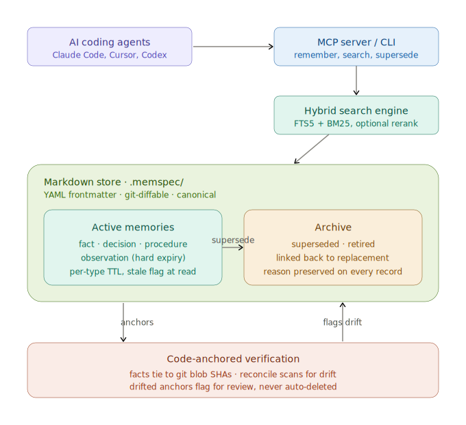

# Memspec

**Memspec is Git-backed project memory for AI coding agents, with verification and drift detection.** Claims about code are anchored to file SHAs; when the code changes, memspec flags the claim for review instead of letting facts rot silently. Duplicate rejection, typed supersede chains, and per-claim provenance turn memory into testable claims, not a notes file.

Markdown files under `.memspec/` are the canonical source of truth: human-readable, git-diffable, greppable. Lose the index, lose speed — not data. No backend service. No hosted memory API. No vendor lock-in.

## Architecture

<p align="center">
  
</p>

Agents `remember` claims and `observe` notes; everything lands as markdown under `.memspec/`. From there a structured layer — lifecycle (`active → superseded → retired`), code anchors, typed links, and temporal validity — feeds FTS5/hybrid search, the MCP server, and session-start hooks, so the next session wakes up with the right context instead of amnesia.

## Features

- **File-canonical.** Memories are markdown files with YAML frontmatter. Human-readable, git-diffable, greppable. Lose the index, lose speed — not data.
- **Three claim types + observations.** `fact`, `decision`, `procedure` with per-type TTLs; `observation` for point-in-time notes with hard expiry.
- **Lifecycle, not curation.** `active | superseded | retired`. Corrections create a new memory linked back to the original; supersede chains preserve the reason on every record involved. Past TTL = stale flag at read time, never deletion.
- **Code-anchored verification.** Tie memories to git blob SHAs. When code drifts, memspec flags drifted anchors for review instead of letting facts about code rot silently.
- **Linked notes** (v0.5+). Records reference other records by id (`refines`, `supports`, `depends_on`, `conflicts_with`, `supersedes`, `superseded_by`). Search can follow these links one or more hops to surface neighbours alongside direct matches; `--include-superseded` lets link-following reach archived predecessors (v0.6+).
- **Temporal validity** (v0.5+). Optional `valid_from` / `valid_to` per memory. Search with `--as-of <iso>` filters by world-state truth window, orthogonal to the `check_by` review schedule.
- **Operator-tier storage** (v0.4+). Records sourced by the operator land in a separate filesystem path with stricter overwrite protection (`--override-operator` required to supersede).
- **Layered stores** (v0.6+). A project `.memspec/` and a global `~/.memspec/` merge at retrieval time — project records take priority, global merges as a lower layer. Every search, context, and MCP path honours the configured `stores:` layers.
- **Dedup-aware writes.** `remember` refuses near-duplicate claims and points at the existing record, so memory accretes corrections via `supersede` instead of silent duplicates.
- **Hybrid search.** SQLite FTS5 + BM25 by default; optional dense embeddings rerank via OpenAI-compatible endpoints or Ollama.
- **MCP server.** Eleven tools, first-class integration with Claude Code, Cursor, Codex.
- **Witnessed claims.** Every memory carries `verified_with` (`anchor | operator | evidence | assertion`) — provenance, not a confidence score.
- **Dream pass** (v0.7+). Periodic reflection script (`memspec-dream`) reads the last N days of memspec writes and git log, asks an LLM to surface stale memories, supersede candidates, verify candidates, missing relations, and behavioural rules worth promoting. Output is review material, never auto-applied.
- **Zero infrastructure.** `npm install -g memspec` + `memspec init`. No accounts, no API keys, no hosted services.

## Install

```bash
npm install -g memspec
```

Or local:

```bash
git clone https://github.com/siimvene/memspec.git
cd memspec && npm install && npm run build && npm link
```

## Quick start

```bash
memspec init                                            # interactive setup, creates .memspec/

memspec remember fact "Auth uses JWT" \                 # write a claim, anchor it to code
  --source agent --tags auth --anchor src/auth/jwt.ts

memspec search "auth"                                   # BM25; --expand-edges follows linked notes

memspec reconcile                                       # find anchored claims whose code drifted
memspec verify ms_01HXK... --evidence "still JWT"       # confirm still true; refreshes timestamp

memspec supersede ms_01HXK... \                         # or replace with a corrected version
  --reason "Migrated to OAuth" --body "Now OAuth2 + PKCE"
```

The `anchor → reconcile → verify | supersede` loop is the differentiator: claims about code stay accountable to the code.

## Why not just AGENTS.md?

| Approach | Reviewable in Git | Code-anchored | Lifecycle | Search | Self-hosted |
|---|---|---|---|---|---|
| `AGENTS.md` / `CLAUDE.md` | yes | no | none | grep | yes |
| `MEMORY.md` / scratchpad | yes | no | none | grep | yes |
| Vector DB (Chroma, Qdrant) | no | no | manual | semantic | yes |
| Hosted memory API (Mem0, Letta) | no | no | hosted | hosted | no |
| **Memspec** | per-claim | yes | typed states | FTS5 + optional hybrid | yes |

If project memory fits in a paragraph in a single file, `AGENTS.md` is fine. Memspec is for when memory grows into a list of claims that need to track code reality, expire, supersede, and link to each other.

## Memory model

Three claim types plus observations, agent-operated, lifecycle handled in the tool:

| Type | Captures | Default TTL |
|---|---|---|
| `fact` | Verified project state | 90d |
| `decision` | A choice with rationale | 180d |
| `procedure` | A reusable workflow | 90d |
| `observation` | Point-in-time, hard expiry | 7d |

Each memory is one markdown file with YAML frontmatter. Past `check_by` → `stale` flag at read time, never deletion. `memspec sweep` is the only removal path, operator-approved one item at a time.

States: `active | superseded | retired`. Corrections create a new memory linked back to the original; supersede chains preserve the reason on every record involved. Everything lives in git history.

## Linked notes

Records reference other records by id in their frontmatter — `refines`, `supports`, `depends_on`, `conflicts_with`, `supersedes`, `superseded_by`. Search can follow these links to surface neighbours alongside direct matches:

```bash
memspec search "v0.5 plan" --expand-edges --expand-depth 1
```

Follows the listed ids one hop out and includes the linked notes in results. Each surfaced neighbour carries `expanded_via` showing how it got there. `--include-superseded` lets expansion reach archived predecessors via supersede chains. `--as-of <iso>` filters by `valid_from` / `valid_to` for world-state queries.

## Code-anchored verification

Calendar TTL is the wrong signal for facts about code. Memspec ties claims to file SHAs:

- `memspec anchor <id> <files...>` — record the git blob SHAs of the files this memory depends on
- `memspec verify <id>` — refresh "still true"; drifted anchors flag for review without mutating the memory
- `memspec reconcile` — scan all anchored memories for drift, including uncommitted edits

Drifted memories never auto-archive. They surface for human judgement via `memspec status`.

## Search

Two engines, picked at `memspec init`:

- **FTS5** (default): SQLite full-text + BM25. Zero setup beyond `better-sqlite3`.
- **Hybrid**: FTS5 candidates plus embeddings rerank. OpenAI-compatible endpoints or Ollama.

Index rebuilds on demand from the markdown files. Lose the index, lose speed — not data.

## Trust profiles

Memspec doesn't enforce a write policy; the agent's instruction file does (see [AGENTS-ADDON.md](AGENTS-ADDON.md)). Two reference profiles:

**Operator solo** (default). The agent writes facts, decisions, procedures, and observations freely. Duplicate rejection, anchor drift, and supersede chains catch bad writes. Friction-free; relies on `git log` to undo mistakes. Suits single-operator setups where memspec is your own agent infrastructure.

**Team review.** For shared repos with multiple writers:

- Observations: agent writes freely.
- Facts: agent writes only when anchored to code; anchorless facts route to a PR for review.
- Decisions: drafted by agent, merged by human.
- Procedures: agent-written, reviewed at first use.
- Operator-tier claims: never overridden without `--override-operator` and a reason in the supersede record.
- Secrets: never stored. Anywhere. Ever.

Pick the profile in your `AGENTS.md` / `CLAUDE.md` and the agent will follow it. The store records every write, so deviations show up in `git log`.

## MCP server

```bash
memspec-mcp                          # stdio in current project
memspec-mcp --cwd /path/to/project   # pin a root
```

`memspec init` auto-creates `.mcp.json` for host tool discovery (Claude Code, Cursor, etc).

Eleven MCP tools: `memspec_search`, `memspec_get`, `memspec_remember`, `memspec_supersede`, `memspec_relate`, `memspec_observe`, `memspec_verify`, `memspec_anchor`, `memspec_reconcile`, `memspec_status`, `memspec_export`. The CLI exposes a superset (`init`, `migrate`, `sweep`, `context` are CLI-only — store creation, schema migration, physical removal, and session-start context are operator acts, not an agent surface).

For manual `.mcp.json` setup:

```json
{
  "mcpServers": {
    "memspec": { "command": "memspec-mcp", "args": ["--cwd", "/abs/path/to/project"] }
  }
}
```

## Global store

`~/.memspec/` is a cross-project memory layer for personal preferences, common patterns, infra knowledge. When both stores exist, the project store takes priority; global merges as a lower layer.

```bash
memspec init --cwd ~/.memspec
```

## Store layout

```
.memspec/
  memory/
    facts/  decisions/  procedures/        # active, agent-tier
    operator/{facts,decisions,procedures}/ # operator-tier (separate path)
  observations/                            # raw, unclassified
  archive/                                 # superseded + retired
  config.yaml                              # search engine, embeddings, decay
```

Frontmatter fields per record: `id`, `kind`, `type`, `state`, `source`, `source_kind`, `verified_with` (`anchor | operator | evidence | assertion`), `tags`, `check_by`, `anchors`, `supersedes`, `superseded_by`, `conflicts_with`, `refines`, `supports`, `depends_on`, optional `valid_from` / `valid_to`. Human-readable, git-diffable, greppable.

## CLI reference

| Command | What |
|---|---|
| `memspec init` | Create `.memspec/`, configure search, install hooks |
| `memspec remember <type> <title> --source <who>` | Write a fact/decision/procedure |
| `memspec observe <text>` | Capture a point-in-time observation |
| `memspec search <query> [--expand-edges] [--include-superseded] [--as-of <iso>]` | Search; optionally follow linked notes |
| `memspec context [--query] [--limit]` | Token-budgeted memory dump for session-start hooks |
| `memspec supersede <id> --reason "..." [--body] [--merge-from <ids>]` | Replace, retract, or merge records |
| `memspec relate --from <id> --to <id> --type <kind>` | Wire a link between records after the fact |
| `memspec verify <id> [--evidence "..."]` | Mark a memory still true; checks anchors |
| `memspec anchor <id> <files...>` | Link a memory to file SHAs |
| `memspec reconcile` | Find anchored memories with drifted code |
| `memspec status` | Health readout (counts, witness, stale, drift, conflicts) |
| `memspec sweep` | Interactively retire stale items (operator-only removal path) |
| `memspec export --format <jsonl\|graphml\|dot>` | Export records and links to stdout |
| `memspec migrate` | v0.2/v0.3 → v0.4+ store migration (idempotent, dry-run by default) |

## Hooks for Claude Code

`memspec init` installs two hooks at `~/.claude/hooks/`:

- `memspec-session-start.js` — runs `memspec context` and injects memory into the session prompt so the agent doesn't have to remember to search
- `memspec-consolidate.js` — on commit, prompts the agent to write memories about what just shipped

Configurable in `.memspec/config.yaml`. Pass `--no-install-hooks` to skip. See [`hooks/`](hooks/) for the scripts.

## Dream pass

A periodic reflection over the store. Reads the last N days of memspec writes + git log, asks an LLM to surface stale memories, supersede / merge candidates, verify candidates, missing typed relations, and behavioural rules worth promoting to your agent instruction file. **Proposals only — never auto-applied.**

```bash
memspec-dream                          # weekly default (7 days, current .memspec/)
memspec-dream 14                       # custom window
MEMSPEC_DREAM_AUTOCOMMIT=1 memspec-dream
```

Output lands at `<store>/dream/YYYY-MM-DD.md` for a human to review. Defaults to invoking `claude` (Claude Code CLI) headlessly; override with `MEMSPEC_LLM_BIN` and `MEMSPEC_LLM_ARGS` for other CLIs.

Cron example (Sunday 22:00 local):

```cron
0 22 * * 0  cd /path/to/project && MEMSPEC_DREAM_AUTOCOMMIT=1 memspec-dream
```

Inspired by [Aaron Fulkerson's Exo](https://aaronfulkerson.com/2026/05/23/meet-exo/) and the [`dream-skill`](https://github.com/grandamenium/dream-skill) prior art.

## Docs

- [SPEC.md](SPEC.md) — design rationale and frontmatter schema
- [SCHEMA.md](SCHEMA.md) — generated field reference (regenerated from Zod via `npm run schema`)
- [CHANGELOG.md](CHANGELOG.md) — release history
- [MIGRATION-v0.3.md](MIGRATION-v0.3.md) — v0.2/v0.3 → v0.4+ upgrade path
- [AGENTS-ADDON.md](AGENTS-ADDON.md) — block to paste into `AGENTS.md` / `CLAUDE.md` if `init` couldn't patch your repo

## License

MIT
